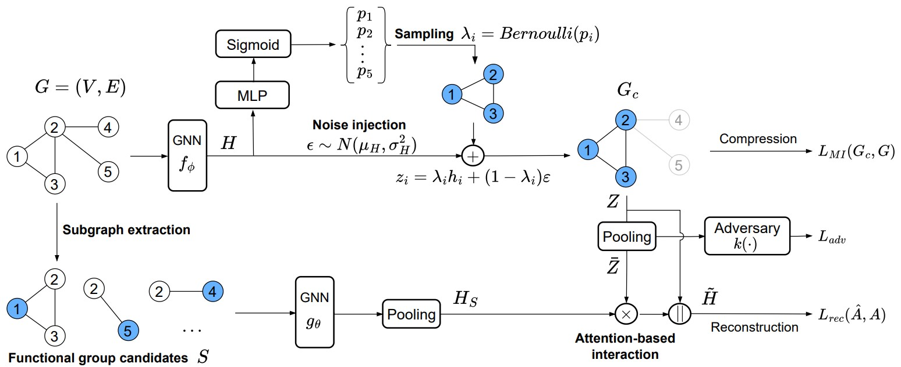

# Subgraph-conditioned Graph Information Bottleneck <br> (S-CGIB)
Subgraph-conditioned Graph Information Bottleneck (S-CGIB) is a novel architecture for pre-training Graph Neural Networks in molecular property prediction and developed by [NS Lab, CUK](https://nslab-cuk.github.io/) based on pure [PyTorch](https://github.com/pytorch/pytorch) backend. The paper is now accepted on **AAAI 2025**.

<p align=center>
  <a href="https://www.python.org/downloads/release/python-360/">
    =3.8.8-3776AB?logo=python&style=flat-square" alt="Python">
  </a>    
  <a href="https://github.com/pytorch/pytorch">
    =1.4-FF6F00?logo=pytorch&style=flat-square" alt="pytorch">
  </a>    
  
  
  
  
  
  
  
</p>

<br>


## 1. Overview

We aim to build a pre-trained Graph Neural Network (GNN) model on molecules without human annotations or prior knowledge. Although various attempts have been proposed to overcome limitations in acquiring labeled molecules, the previous pre-training methods still rely on semantic subgraphs, i.e., functional groups. Only focusing on the functional groups could overlook the graph-level distinctions. The key challenge to build a pre-trained GNN on molecules is how to (1) generate well-distinguished graph-level representations and (2) automatically discover the functional groups without prior knowledge. To solve it, we propose a novel Subgraph-conditioned Graph Information Bottleneck, named S-CGIB, for pre-training GNNs to recognize core subgraphs (graph cores) and significant subgraphs. The main idea is that the graph cores contain compressed and sufficient information that could generate well-distinguished graph-level representations and reconstruct the input graph conditioned on significant subgraphs across molecules under the S-CGIB principle. To discover significant subgraphs without prior knowledge about functional groups, we propose generating a set of functional group candidates, i.e., ego networks, and using an attention-based interaction between the graph core and the candidates. Despite being identified from self-supervised learning, our learned subgraphs match the real-world functional groups. Extensive experiments on molecule datasets across various domains demonstrate the superiority of S-CGIB.

<br>

<p align="center">
  
  <br>
  <b></b> The overall architecture of Subgraph-conditioned Graph Information Bottleneck.
</p>

## 2. Reproducibility

### Datasets 

We used publicly available datasets, which are automatically downloaded from Pytorch Geometric.
The datasets are grouped into main domains: Biophysics (mol-HIV, mol-PCBA, and BACE), Physiology (BBBP, Tox21, ToxCast, SIDER, ClinTox, and MUV), Physical Chemistry (ESOL and FreeSolv), Bioinformatics (Mutagenicity, NCI1, and NCI109), Quantum Mechanics (PCQ4Mv2 and QM9).


### Requirements and Environment Setup

The source code was developed in Python 3.8.8. S-CGIB is built using Torch-geometric 2.3.1 and DGL 1.1.0. Please refer to the official websites for installation and setup.
All the requirements are included in the ```environment.yml``` file.

```
# Conda installation

# Install python environment

conda env create -f environment.yml 
```
The source code contains both self-supervised pre-training and fine-tuning processes. 
We also provide our pre-trained model (S-CGIB), named pre_training_v1_GIN_64_5_1.pt, in the folder outputs/. 
"GIN_64_5_1" refers to CGIB was pre-trained with 5-layer GIN encoder and 1-hop subgraphs.

### Self-supervised pre-training

#### Pre-processing the pre-training datasets
```
# Pre-processing the datasets for pre-training, i.e., PCQ4Mv2, QM9, and mol-PCBA.
python exp_pcqm4mv2.py
python exp_qm9.py
python exp_molpcba.py
```
#### pre-training
```
# Use the following command to run the pretrain task, the output will generate the pre-trained files in the folder outputs/.
python exp_pretraining.py --encoder GIN --k_transition 1 --device cuda:0
```

### Hyperparameters

The following options can be passed to the below commands for fine-tuning the model:

```--encoder:``` The graph encoder. For example: ```--encoder GIN```

```--lr:``` Learning rate for fine-tuning the model. For example: ```--lr 0.001```

```--dims:``` The dimmension of hidden vectors. For example: ```--dims 64```

```--num_layers:``` Number of layers for model training. For example: ```--num_layers 5``` 

```--k_transition:``` The size of subgraphs. For example: ```--k_transition 1```

```--pretrained_ds:``` The file name of the pre-trained model. For example: ```--pretrained_ds pre_training_v1```

```--domain_adapt:``` The use of domain adaptation, i.e., 1 (Yes) and 0 (No).  For example: ```--domain_adapt 1```.

```--adapt_epoches:```Number of epochs for domain adaptation. For example: ```--adapt_epoches 30```.

```--ft_epoches:```Number of epochs for fine-tuning the pre-trained model. For example: ```--ft_epoches 50```.

```--batch_size:``` The size of a batch. For example: ```--batch_size 128```.

```--device:``` The GPU id. For example: ```--device 0```.

### How to fine-tune S-CGIB

The following commands will run the fine-tuning the **S-CGIB** on different datasets.
The model performance will be sent to the command console.

#### For BBBP and BACE Datasets
```
python exp_moleculenetBACE_BBBP.py --dataset BBBP --pretrained_ds pre_training_v1
``` 
#### For MUV, SIDER, Tox21, ClinTox, and ToxCast Datasets
```
python exp_moleculeSTCT.py  --dataset Tox21 --pretrained_ds pre_training_v1
``` 
#### For ogbg-molhiv Dataset
```
python exp_molhiv.py  --pretrained_ds pre_training_v1
``` 
#### For FreeSolv,  ESOL, and Lipo Datasets
```
python exp_molsolv.py  --dataset FreeSolv --pretrained_ds pre_training_v1
``` 
#### For NCI1, NCI109, and Mutagenicity Datasets
```
python exp_tudataset.py  --dataset Mutagenicity --pretrained_ds pre_training_v1
``` 
#### For Peptides-func Dataset
```
python exp_pep_func_5.py  --pretrained_ds pre_training_v1
``` 
#### For Peptides-struct Dataset
```
python exp_pep_struct_5.py  --pretrained_ds pre_training_v1
``` 


## 3. Reference

:page_with_curl: Paper [on arXiv](https://arxiv.org/): 
* [](https://arxiv.org/abs/2412.15589) 

:chart_with_upwards_trend: Experimental results [on Papers With Code](https://paperswithcode.com/): 
* [](https://paperswithcode.com/paper/pre-training-graph-neural-networks-on)

:pencil: Blog post [on Network Science Lab](https://nslab-cuk.github.io/2024/12/19/SCGIB/): 
* [](https://nslab-cuk.github.io/2024/12/19/SCGIB/)


## 4. Citing S-CGIB

Please cite our [paper](https://arxiv.org/abs/2412.15589) if you find *S-CGIB* useful in your work:
```
@misc{hoang2024pretraininggraphneuralnetworks,
      title={Pre-training Graph Neural Networks on Molecules by Using Subgraph-Conditioned Graph Information Bottleneck}, 
      author={Van Thuy Hoang and O-Joun Lee},
      year={2024},
      eprint={2412.15589},
      archivePrefix={arXiv},
      primaryClass={cs.LG},
      url={https://arxiv.org/abs/2412.15589}, 
}
```

Please take a look at our unified graph transformer model, [**UGT**](https://github.com/NSLab-CUK/Unified-Graph-Transformer), which can preserve local and globl graph structure, and community-aware graph transformer model, [**CGT**](https://github.com/NSLab-CUK/Community-aware-Graph-Transformer), which can mitigate degree bias problem of message passing mechanism, together. 


## 5. Contributors

<a href="https://github.com/NSLab-CUK/S-CGIB/graphs/contributors">
  
</a>


<br>

***

<a href="https://nslab-cuk.github.io/"></a>

***


